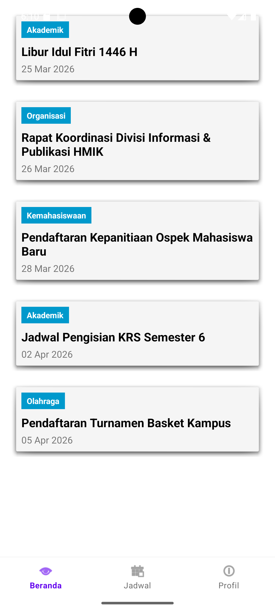
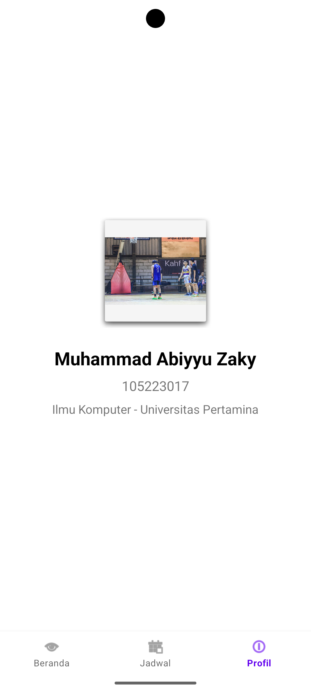
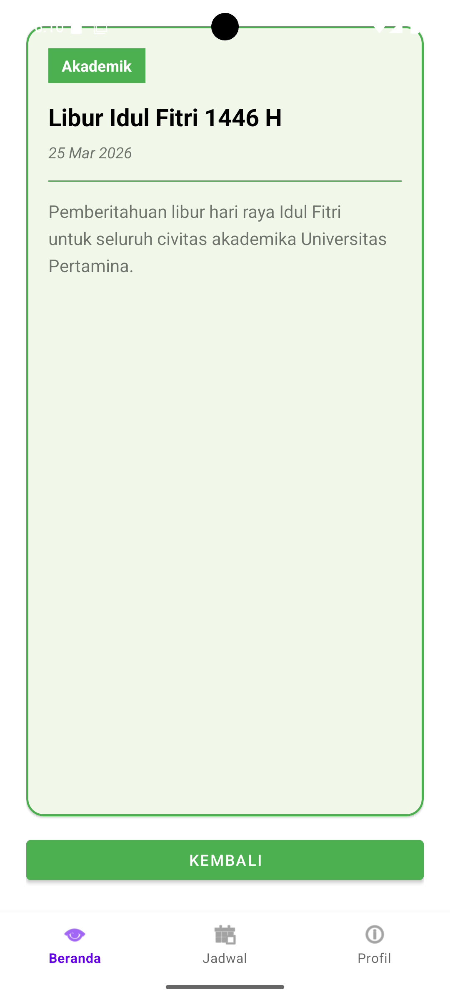
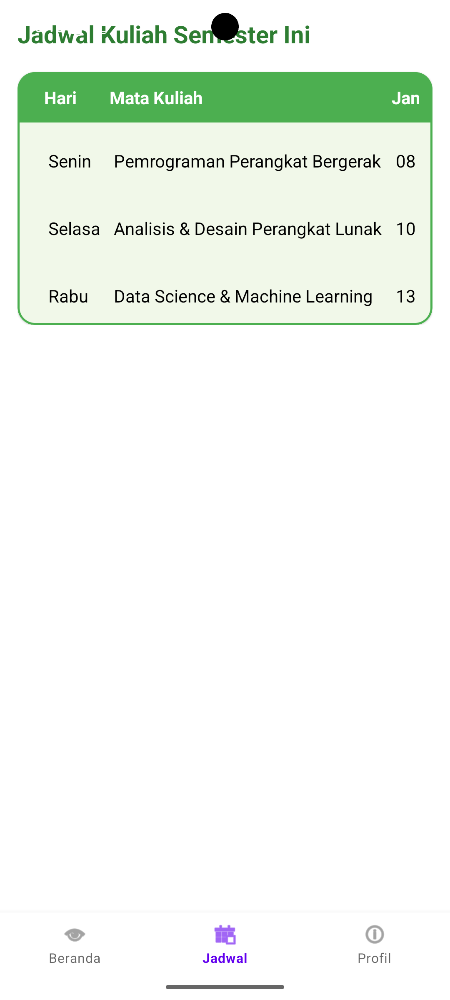

# -THR-PPB-105223017---Muhammad-Abiyyu-Zaky

# CampusInfo App

Aplikasi informasi kampus sederhana yang mengintegrasikan Navigation Component, RecyclerView, dan Fragment Lifecycle Awareness. Dibuat untuk memenuhi Tugas Hari Raya (THR) mata kuliah Pemrograman Perangkat Bergerak.

## Identitas Mahasiswa
* **Nama Lengkap:** Muhammad Abiyyu Zaky
* **NIM:** 105223017
* **Link Repository GitHub:** https://github.com/JEKICEN26/-THR-PPB-105223017---Muhammad-Abiyyu-Zaky.git

## Fitur Aplikasi
* **Bottom Navigation:** Navigasi mulus antar 3 tab utama (Beranda, Jadwal, Profil).
* **Daftar Pengumuman:** Menampilkan data statis pengumuman menggunakan RecyclerView dan ListAdapter.
* **Detail Pengumuman:** Mengirimkan data ID secara aman menggunakan Safe Args ke halaman detail.
* **Tampilan UI:** Dimodifikasi dengan MaterialCardView untuk sudut melengkung dan tema warna hijau.
  
## Screenshots

